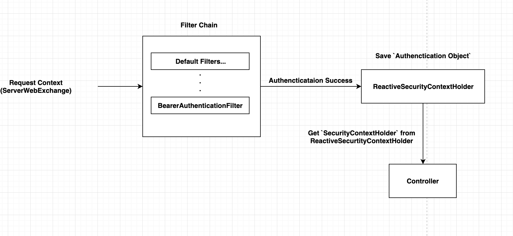
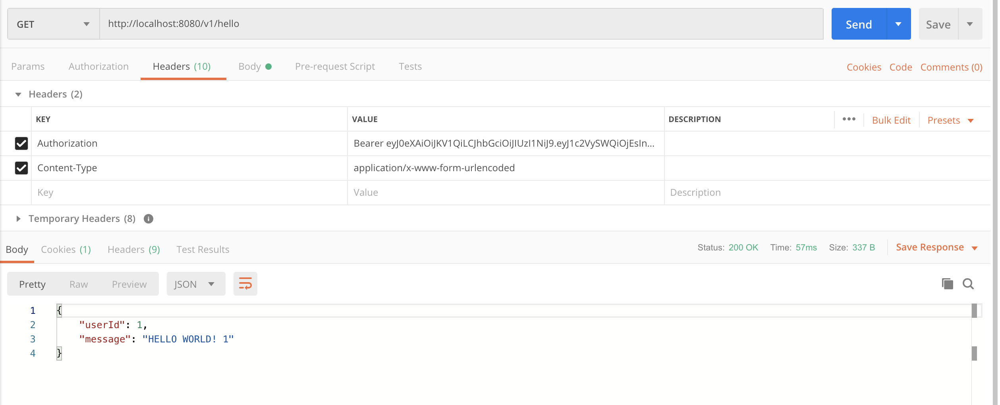

## Spring webflux JWT example

this is spring webflux jwt token example.

I was inspired by the GitHub project below.

`
https://github.com/mohammad-mazraeshahi/spring-security-webflux-example
`

I referenced the project above to make a JWT token custom filter, and added an example of extracting tokens from Route.

### Library Dependencies

```aidl
<dependencies>
        <dependency>
            <groupId>org.springframework.boot</groupId>
            <artifactId>spring-boot-starter-webflux</artifactId>
        </dependency>
        <dependency>
            <groupId>org.springframework.boot</groupId>
            <artifactId>spring-boot-starter-security</artifactId>
        </dependency>
        <dependency>
            <groupId>org.springframework.boot</groupId>
            <artifactId>spring-boot-starter-test</artifactId>
            <scope>test</scope>
        </dependency>
        <!-- jwt token auth support library -->
        <dependency>
            <groupId>com.auth0</groupId>
            <artifactId>java-jwt</artifactId>
            <version>3.8.0</version>
        </dependency>
        <dependency>
            <groupId>org.projectlombok</groupId>
            <artifactId>lombok</artifactId>
            <version>1.18.4</version>
            <scope>provided</scope>
        </dependency>
    </dependencies>
```

### JWT token payload

```aidl
{
  "type": "accessToken"
  "userId": 1,
}
```

### Jwt Token Extraction Process



### Result image

If the access token is valid, extract the ID from the token and respond.



### example JWT token
```
eyJhbGciOiJIUzI1NiIsInR5cCI6IkpXVCJ9.eyJleHAiOjE2NjU2MjMxNTUsImlhdCI6MTY2NTU4NzE1NSwianRpIjoiZGU2ZDYyOGUtOTBlMC00ZDI2LWFkN2QtZWMzMmM4ZjgyZmE0IiwiaXNzIjoiaHR0cDovL2xvY2FsaG9zdC9hdXRoL3JlYWxtcy90ZXN0IiwiYXVkIjoiYWNjb3VudCIsInN1YiI6ImVhZjFhNGE2LTRjYmMtNGU0Ni1iOTc1LTUyM2VhMjE0ZjVjMyIsInR5cCI6IkJlYXJlciIsImF6cCI6InRlc3QiLCJzZXNzaW9uX3N0YXRlIjoiMjUzYmQ4MGEtNmVkZi00MzdhLTk4YjUtNzRiZWIyN2NlNTE5IiwiYWNyIjoiMSIsInJlYWxtX2FjY2VzcyI6eyJyb2xlcyI6WyJvZmZsaW5lX2FjY2VzcyIsInVtYV9hdXRob3JpemF0aW9uIl19LCJyZXNvdXJjZV9hY2Nlc3MiOnsidGVzdCI6eyJyb2xlcyI6WyJBRE1JTiIsIlVTRVIiXX0sImFjY291bnQiOnsicm9sZXMiOlsibWFuYWdlLWFjY291bnQiLCJtYW5hZ2UtYWNjb3VudC1saW5rcyIsInZpZXctcHJvZmlsZSJdfX0sInNjb3BlIjoicHJvZmlsZSBlbWFpbCIsImVtYWlsX3ZlcmlmaWVkIjp0cnVlLCJuYW1lIjoibmFtZSIsInByZWZlcnJlZF91c2VybmFtZSI6InRlc3RAdGVzdC5jb20iLCJnaXZlbl9uYW1lIjoibmlrbmFtZSIsImZhbWlseV9uYW1lIjoiZmFtaWx5IiwiZW1haWwiOiJ0ZXN0QHRlc3QuY29tIn0.6QW_NErSZAt9BA67qy_9_bijR4FKzxOibsaEOvY993c
```

